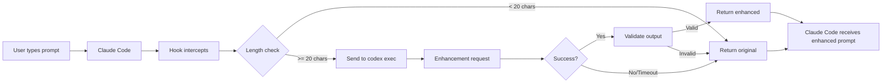

# Prompt Enhancer Hook - Implementation Summary

## Overview

Created a user-prompt-submit hook for Claude Code that automatically enhances user prompts using the codex CLI to make them more effective for AI agents.

## Files Created

### 1. Hook Script
**File**: [`scripts/prompt-enhancer-hook.sh`](../scripts/prompt-enhancer-hook.sh)

Bash script that:
- Receives user prompts via stdin
- Uses `codex exec` to refine prompts for better AI comprehension
- Returns enhanced prompts via stdout
- Includes smart filtering (skips very short prompts)
- Has fail-safe behavior (returns original on error/timeout)
- Supports optional logging via `PROMPT_ENHANCER_LOG=1`

**Key Features**:
- 10-second timeout to prevent hanging
- Validation of enhanced output
- Graceful fallback to original prompt
- Minimum length threshold (20 chars)

### 2. Configuration
**File**: [`.vscode/settings.json`](../.vscode/settings.json)

Workspace settings that enable the hook:
```json
{
  "claudeCode.hooks.userPromptSubmit": "${workspaceFolder}/scripts/prompt-enhancer-hook.sh"
}
```

### 3. Documentation
**File**: [`docs/PROMPT_ENHANCER_HOOK.md`](./PROMPT_ENHANCER_HOOK.md)

Comprehensive documentation including:
- Installation instructions
- Usage examples
- Configuration options
- Troubleshooting guide
- Performance considerations
- Before/after examples

### 4. Quick Start Guide
**File**: [`docs/HOOKS_QUICK_START.md`](./HOOKS_QUICK_START.md)

Quick reference for:
- Setup steps
- Testing instructions
- Enabling/disabling the hook
- Common workflows

### 5. Test Script
**File**: [`scripts/test-prompt-enhancer.sh`](../scripts/test-prompt-enhancer.sh)

Automated test suite that validates:
- Short prompts pass through unchanged
- Empty prompts pass through unchanged
- Medium-length prompts get enhanced
- Logging functionality works
- Codex CLI availability

## How It Works



## Enhancement Process

The hook sends this meta-prompt to codex:

```
You are a prompt refinement specialist. Your task is to take a user's prompt
and enhance it to be more effective for an AI coding agent.

Guidelines for enhancement:
1. Maintain the user's core intent and requirements
2. Add clarity and specificity where needed
3. Break down complex requests into clear steps if appropriate
4. Include relevant technical context that helps the agent
5. Suggest validation or testing steps if applicable
6. Keep the enhanced prompt concise but complete
7. Do not change the fundamental request
8. If the prompt is already well-formed, only make minor improvements

Original user prompt:
"""
[USER'S ORIGINAL PROMPT]
"""

Provide ONLY the enhanced prompt as your response, with no preamble or explanation.
```

## Example Transformations

### Example 1: Simple Enhancement
**Input**: `add error handling`

**Output**:
```
Add comprehensive error handling to the current module. Include:
1. Try-catch blocks around async operations
2. Input validation with clear error messages
3. Proper error logging
4. Graceful fallback behavior where appropriate
Please ensure existing functionality is preserved and add tests for error cases.
```

### Example 2: Feature Request Enhancement
**Input**: `add dark mode`

**Output**:
```
Implement dark mode support for the application. Requirements:
1. Add dark mode toggle in settings/preferences
2. Implement CSS variables or theme system for colors
3. Update all UI components to respect theme preference
4. Persist user's theme choice
5. Handle system theme preference detection
6. Ensure sufficient contrast for accessibility
Test across all main application views.
```

### Example 3: Bug Fix Enhancement
**Input**: `fix the memory leak`

**Output**:
```
Investigate and fix the reported memory leak. Steps:
1. Identify the source of the memory leak using available debugging tools
2. Review object lifecycle and cleanup code
3. Implement proper resource disposal
4. Add tests to prevent regression
5. Verify fix with memory profiling
Please document the root cause and solution in comments.
```

## Usage

### Automatic (Recommended)

Once configured, the hook runs automatically. Just use Claude Code normally:

1. Type your prompt
2. Press Enter
3. Hook enhances it automatically
4. Claude Code receives enhanced version

### Manual Testing

```bash
# Test the hook directly
echo "add tests" | ./scripts/prompt-enhancer-hook.sh

# Test with logging
PROMPT_ENHANCER_LOG=1 ./scripts/prompt-enhancer-hook.sh <<<"add tests"

# Run test suite
./scripts/test-prompt-enhancer.sh
```

### Enable Logging

See before/after comparisons:

```bash
# Temporary
export PROMPT_ENHANCER_LOG=1

# Permanent (add to ~/.bashrc or ~/.zshrc)
echo 'export PROMPT_ENHANCER_LOG=1' >> ~/.bashrc
```

## Configuration Options

### Timeout
**Default**: 10 seconds
**Location**: Line ~92 in `scripts/prompt-enhancer-hook.sh`

```bash
if timeout 10s codex exec "$enhancement_request" ...
```

### Minimum Length
**Default**: 20 characters
**Location**: Line ~35 in `scripts/prompt-enhancer-hook.sh`

```bash
if [[ ${#original_prompt} -lt 20 ]]; then
```

### Logging
**Default**: Disabled
**Enable**: `export PROMPT_ENHANCER_LOG=1`

## Performance

- **Latency**: ~1-5 seconds per prompt (depends on codex CLI)
- **Timeout**: Maximum 10 seconds
- **Cost**: Uses codex CLI credits for each enhancement
- **Optimization**: Short prompts (< 20 chars) skip enhancement

## Fail-Safe Behavior

The hook returns the **original prompt unchanged** in these cases:

1. **codex CLI not installed**: Graceful fallback
2. **Enhancement times out**: After 10 seconds
3. **Enhanced prompt is empty**: Validation failure
4. **Enhanced prompt is shorter**: Validation failure
5. **Any error occurs**: Catch-all safety

This ensures the user's workflow is never blocked.

## Testing

Run the test suite:

```bash
./scripts/test-prompt-enhancer.sh
```

Expected output:
```
Testing Prompt Enhancer Hook
==============================

Test 1: Very short prompt (should skip enhancement)
---------------------------------------------------
✓ PASS: Short prompt passed through unchanged

Test 2: Empty prompt
-------------------
✓ PASS: Empty prompt passed through unchanged

Test 3: Medium-length prompt (should be enhanced if codex available)
--------------------------------------------------------------------
✓ PASS: Prompt was enhanced (47 chars -> 312 chars)

Test 4: Test with logging enabled
---------------------------------
[Shows before/after comparison]

Test 5: Codex CLI availability
------------------------------
✓ codex CLI is installed
```

## Integration with Workspace

This hook complements the existing codex workflows:

- **codex-review-loop.js**: Paired sessions for iterative code review
- **CLAUDE.md**: Project context and guidance
- **MCP servers**: SNES development tools

The prompt enhancer ensures that all user requests to Claude Code are optimally phrased for the agent to understand and execute effectively.

## Next Steps

### Immediate Use
1. Hook is configured and ready to use
2. Restart Claude Code if currently running
3. Start typing prompts - enhancement is automatic

### Optional Setup
1. Enable logging to see enhancements: `export PROMPT_ENHANCER_LOG=1`
2. Run test suite to verify: `./scripts/test-prompt-enhancer.sh`
3. Adjust timeout/length thresholds if needed

### Future Enhancements
- Cache common prompt patterns to reduce latency
- Learn from user edits to refined prompts
- Project-specific enhancement rules from CLAUDE.md
- Async enhancement with preview option
- Integration with MCP server context

## Troubleshooting

### Hook doesn't run
1. Verify codex CLI: `which codex`
2. Check hook is executable: `ls -l scripts/prompt-enhancer-hook.sh`
3. Check Claude Code settings: Open Settings → Search "Claude Code Hooks"
4. Check Claude Code Output panel for errors

### Enhancement too slow
1. Reduce timeout (edit script)
2. Increase minimum length threshold
3. Disable for quick iterations

### Want to disable
- Comment out in `.vscode/settings.json`, or
- Rename hook script, or
- Clear setting in VSCode UI

## References

- **Hook Script**: [`scripts/prompt-enhancer-hook.sh`](../scripts/prompt-enhancer-hook.sh)
- **Full Documentation**: [`docs/PROMPT_ENHANCER_HOOK.md`](./PROMPT_ENHANCER_HOOK.md)
- **Quick Start**: [`docs/HOOKS_QUICK_START.md`](./HOOKS_QUICK_START.md)
- **Test Script**: [`scripts/test-prompt-enhancer.sh`](../scripts/test-prompt-enhancer.sh)
- **VSCode Settings**: [`.vscode/settings.json`](../.vscode/settings.json)
- **Related**: [`scripts/codex-review-loop.js`](../scripts/codex-review-loop.js)
- **Claude Code Hooks**: https://docs.claude.com/en/docs/claude-code/user-hooks
